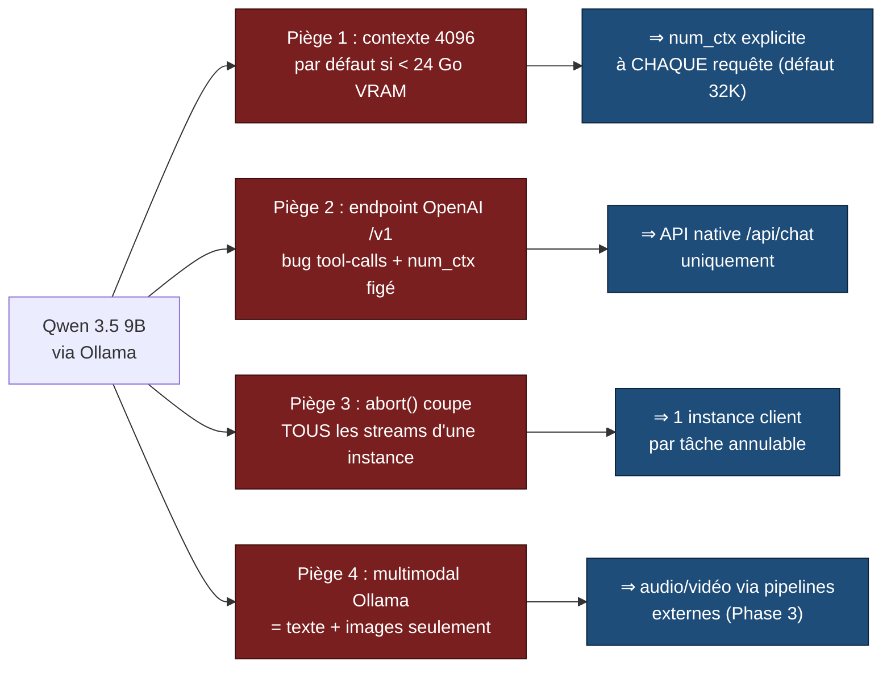
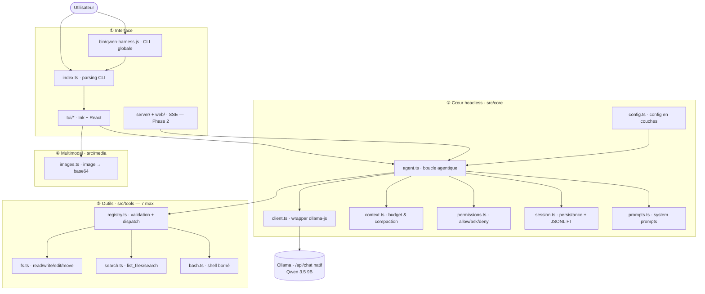
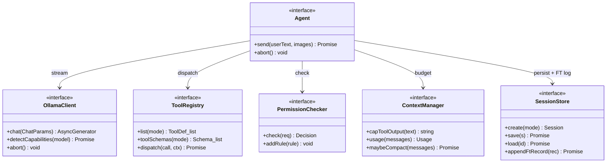
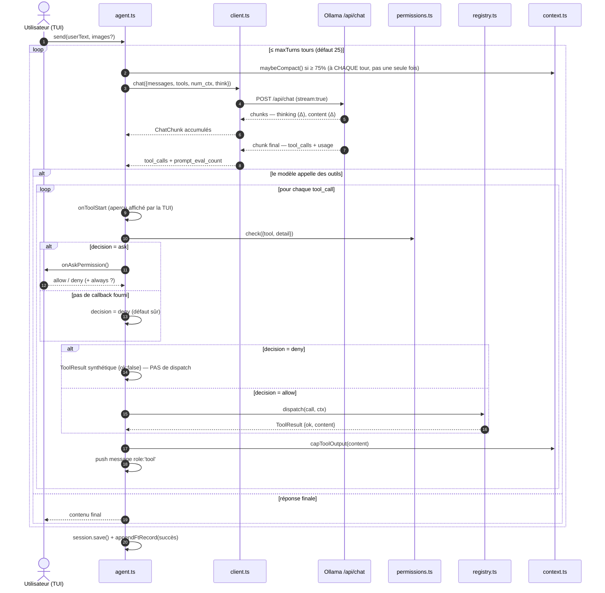
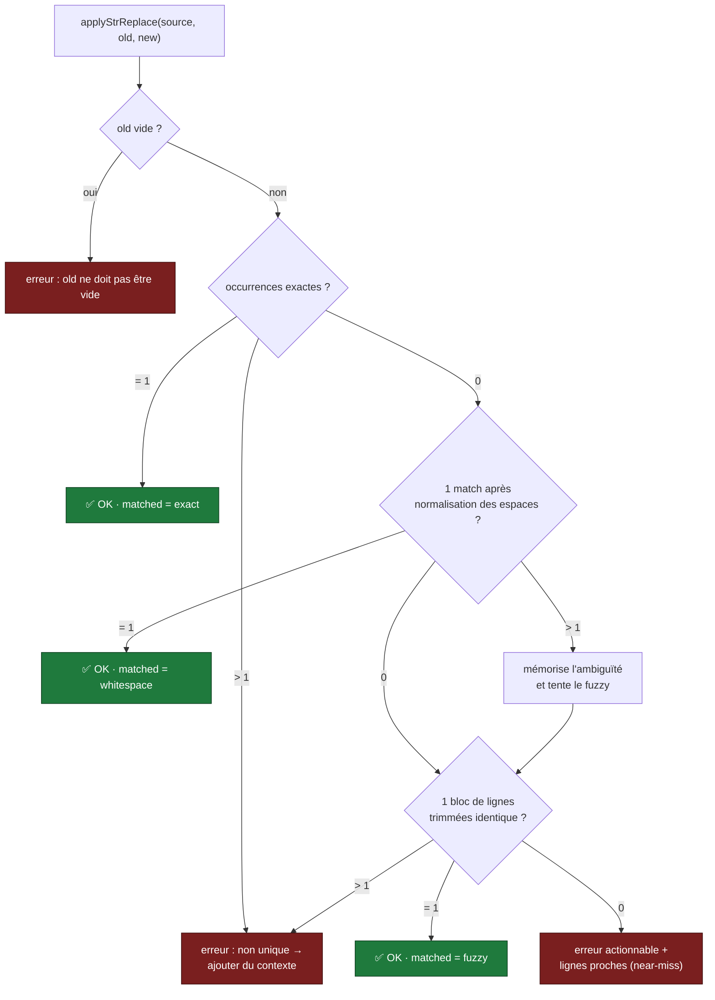
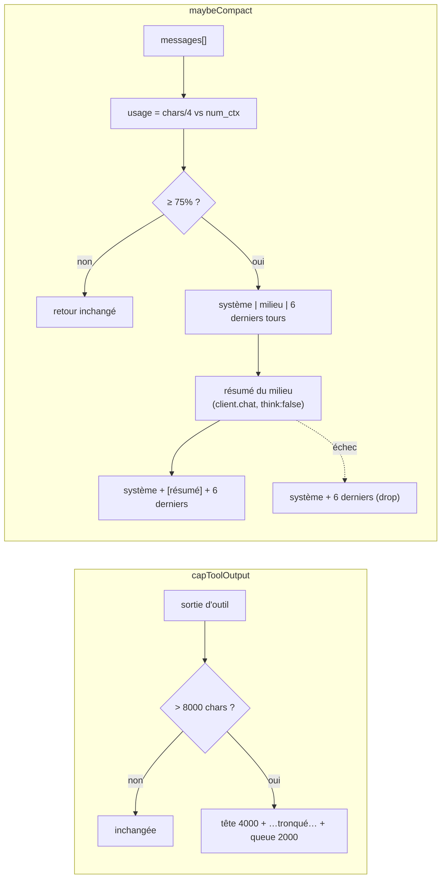
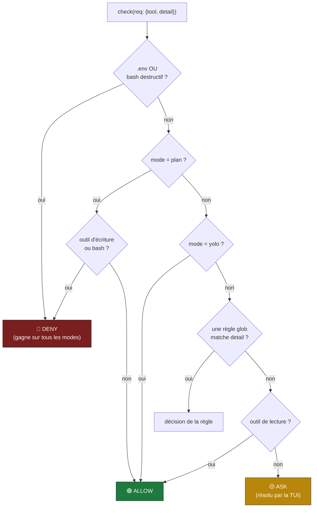
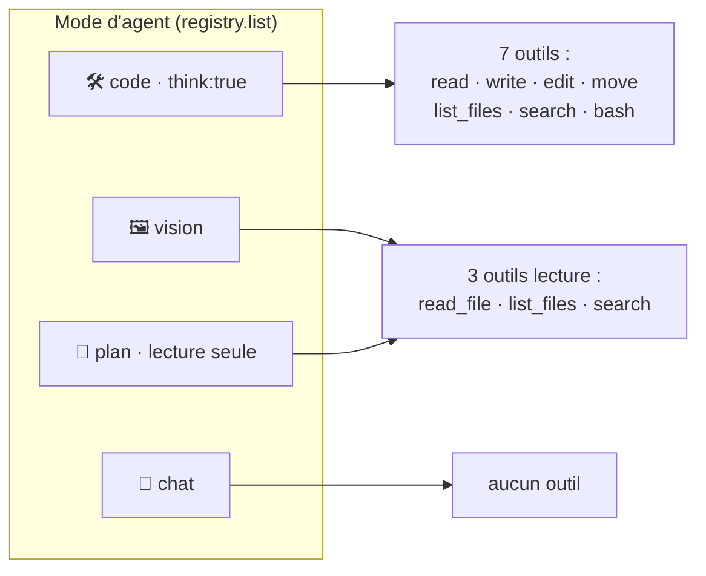
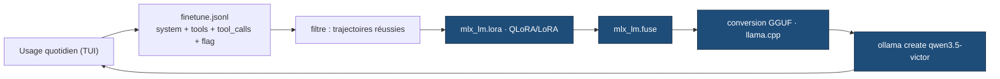
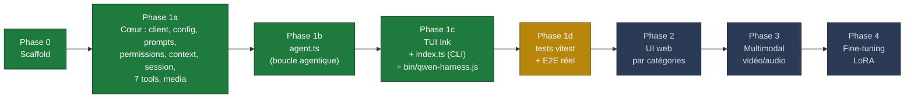

# qwen-harness — Un harnais agentique local pour Qwen 3.5 9B

### Conception, architecture et ingénierie de fiabilité pour petits modèles

> **Document de référence / research paper interne**
> Version 0.1.0 · mise à jour le 17 juillet 2026 (faits d'environnement vérifiés le 16 juillet 2026) · Cible : Qwen 3.5 9B via Ollama 0.32
> Ce document explique *pourquoi* le projet existe, *comment* il est conçu, et *où* il en est.
> Pour l'installation et l'usage courant, voir [README.md](README.md). Ce document complète (sans les remplacer)
> [docs/CONTRACTS.md](docs/CONTRACTS.md) et [docs/RUNTIME_API.md](docs/RUNTIME_API.md) — les spécifications de
> build d'origine (`PLAN.md`, `CONCEPT.md`) ont été retirées du dépôt une fois leur objectif atteint ; ce document
> en est désormais la synthèse à jour.

---

## Résumé (abstract)

`qwen-harness` est un **harnais de codage agentique 100 % local** : une boucle d'agent qui pilote **Qwen 3.5 9B** servi par **Ollama**, avec un jeu d'outils permettant de lire, éditer, déplacer des fichiers et exécuter des commandes dans une codebase — sans dépendre d'un LLM cloud facturé au token.

La thèse centrale du projet n'est pas « faire tourner un LLM en local » (c'est trivial), mais **rendre un modèle de 9 milliards de paramètres suffisamment fiable pour de l'agentique réelle**. Un modèle de cette taille échoue là où un modèle frontier réussit : arguments d'outils malformés, éditions qui ne « matchent » pas, dérive sur les tâches longues, saturation du contexte. Le cœur technique du harnais est donc une série de **mitigations de fiabilité** : peu d'outils aux descriptions courtes, édition par remplacement de chaîne à **matching progressif**, validation stricte des arguments avec erreurs *actionnables* pour permettre au modèle de réessayer, budget de contexte avec compaction, et un moteur de permissions à règles dures.

À terme, le harnais alimente une **boucle d'auto-amélioration** : chaque session réussie est journalisée en JSONL au format d'entraînement, constituant le corpus d'un futur fine-tuning LoRA (Phase 4) — le modèle s'améliore sur *vos* tâches, à vos frais fixes.

---

## 1. Introduction & motivation

### 1.1 Le problème

Les assistants de codage agentiques (Cowork, Claude Code, Cursor, aider…) sont excellents mais reposent sur des API cloud facturées à l'usage. Pour un usage intensif et quotidien, la facture croît sans plafond, et le contrôle du code source du harnais lui-même échappe à l'utilisateur.

L'objectif du projet est **l'indépendance** :

1. **Ne plus dépendre d'un LLM cloud** — donc coût marginal nul par requête, données qui ne quittent pas la machine.
2. **Contrôler 100 % du code source** du harnais — pas de boîte noire.
3. **Reproduire les capacités d'un agent de codage** — éditer des codebases, déplacer/créer des fichiers, exécuter des commandes, de façon agentique.
4. **À terme, fine-tuner** le modèle sur ses propres données pour de meilleurs résultats.

### 1.2 Le pari technique

Le pari est qu'un modèle **9B dense quantifié (Q4_K_M)**, tenant dans **16 Go de RAM** sur un Mac M4, peut faire du travail agentique *utile* — à condition d'entourer le modèle du bon échafaudage. C'est un pari non trivial : les boucles d'agent sont impitoyables avec les petits modèles, car une seule erreur d'outil peut faire dérailler toute une trajectoire.

Le harnais est donc autant un travail d'**ingénierie de la fiabilité** que d'intégration LLM.

### 1.3 Positionnement

| Système | Modèle | Local | Code source contrôlé | Coût marginal |
|---|---|---|---|---|
| Claude Code / Cowork | Cloud frontier | ✗ | ✗ | par token |
| Cursor | Cloud | ✗ | ✗ | par token / abo |
| aider (+ Ollama) | au choix | ✓ | partiel | nul |
| **qwen-harness** | **Qwen 3.5 9B** | **✓** | **✓ (intégral)** | **nul** |

Le harnais s'inspire des patterns éprouvés d'`aider` (édition par `str_replace`, secours architecte/éditeur) tout en gardant une base de code minimale, entièrement possédée, et pensée dès le jour 1 pour le fine-tuning.

---

## 2. Contexte technique : Qwen 3.5 9B + Ollama

Les faits ci-dessous ont été **vérifiés sur la machine cible** le 16/07/2026 (voir [RUNTIME_API.md](docs/RUNTIME_API.md) §0) et dictent l'essentiel des décisions d'architecture.

- **Matériel** : Mac Apple M4, **16 Go RAM** — *la contrainte structurante n°1*.
- **Runtime** : Node v26, Ollama serveur **0.32.0** sur `http://localhost:11434`.
- **Modèle** : `qwen3.5:latest` — 9,7 B dense, Q4_K_M, 6,6 Go sur disque.
- **Capacités** (via `/api/show`) : `completion`, `vision`, `tools`, `thinking`.
- **Contexte max** : 262 144 tokens — mais **inexploitable en entier** à 16 Go.

### 2.1 Les pièges qui ont façonné le design



1. **Le contexte tombe à 4096 par défaut** sous 24 Go de VRAM. *Un agent meurt avec 4K de contexte.* → On impose `options.num_ctx` (défaut **32 768**) à **chaque** requête.
2. **L'endpoint OpenAI `/v1` est cassé** pour ce cas : bug d'index sur les tool-calls multiples en streaming (ollama#15457) et `num_ctx` non réglable par requête. → **API native `/api/chat` uniquement.**
3. **`ollama.abort()` coupe *tous* les streams** d'une instance `Ollama`. → **Une instance de client par tâche annulable.**
4. **Ollama ne gère nativement que texte + images.** Pas d'audio/vidéo dans l'API. → Phase 3 : vidéo = frames `ffmpeg`, audio = STT externe (`whisper.cpp`) en amont.

### 2.2 Budget mémoire

À 16 Go, le KV-cache est le facteur limitant. L'architecture hybride **Gated DeltaNet** de Qwen 3.5 réduit ce cache (seules 8 des 32 couches font de l'attention pleine), ce qui rend 32K viable. Options de repli si la pression mémoire monte : réduire à 24K, ou `OLLAMA_KV_CACHE_TYPE=q8_0`.

---

## 3. Principes de conception

Sept principes non négociables gouvernent toutes les décisions 

| # | Principe | Justification |
|---|---|---|
| P1 | **API native `/api/chat`**, jamais `/v1` | contourne les bugs de tool-calls et le `num_ctx` figé |
| P2 | **`num_ctx` explicite partout** | évite le silencieux fallback à 4K qui tue l'agent |
| P3 | **7 outils maximum, descriptions courtes** | un 9B se perd avec trop d'outils ou de verbiage |
| P4 | **Édition par `str_replace` à matching progressif** | pas de diff/numéros de ligne (fragiles), tolérance aux imperfections |
| P5 | **Erreurs d'outils *actionnables*, jamais lancées** | le modèle lit l'erreur et réessaie au lieu de crasher la boucle |
| P6 | **Cœur `core/` headless, zéro import UI** | même moteur pour TUI (Phase 1) et Web (Phase 2) |
| P7 | **Log JSONL d'entraînement dès le jour 1** | constitue le corpus de fine-tuning (Phase 4) |

Un huitième, transverse : **ne jamais crasher la boucle**. Permissions, context, session, dispatch d'outils — tous dégradent gracieusement plutôt que de lever une exception qui interromprait la trajectoire.

---

## 4. Architecture du système

Le harnais est structuré en **quatre couches**, avec une règle d'or : `src/core/` est **headless** — aucun fichier du cœur n'importe quoi que ce soit de l'UI. La même logique alimente donc la TUI (Phase 1) puis l'UI web (Phase 2).



### 4.1 Les contrats entre modules (les « seams »)

Tout le code est écrit **contre des interfaces** définies dans `src/core/types.ts`, ce qui a permis de développer les modules en parallèle. `agent.ts` (`createAgent`) ne construit aucune de ses dépendances : il les **reçoit** déjà construites. C'est la couche hôte — aujourd'hui [src/tui/App.tsx](src/tui/App.tsx) (lignes 86-99) — qui assemble les cinq autres factories (`createClient`, `createRegistry`, `createPermissions`, `createContext`, `createSessionStore`) puis les passe à `createAgent` ; en Phase 2, ce sera le serveur web qui jouera ce rôle de composition, sans toucher au cœur.



---

## 5. Le cœur agentique

### 5.1 La boucle d'agent — [src/core/agent.ts](src/core/agent.ts)  ✅ implémenté (258 lignes)

C'est l'orchestrateur. À chaque tour, il envoie l'historique au modèle, **accumule** le stream (`thinking` puis `content` puis `tool_calls`), et si le modèle demande des outils, les fait passer par le filtre de permissions, les exécute **l'un après l'autre**, réinjecte les résultats en `role:'tool'`, et recommence — jusqu'à ce que le modèle réponde sans outil, ou que la limite de **`config.maxTurns` tours** (défaut 25, relue en direct à chaque itération) soit atteinte.



Points clés du contrat, tels qu'implémentés :
- **Accumulation du stream** : chaque chunk porte un *delta*. La boucle recompose un seul `Message` assistant (thinking + content + tool_calls) avant de le pousser dans l'historique.
- **Plusieurs appels d'outils par tour** : Qwen peut émettre plusieurs `tool_calls` sur un tour ; chacun est vérifié et exécuté **l'un après l'autre** (pas de concurrence), chaque résultat renvoyé en `{role:'tool', tool_name, content}` (**pas de `tool_call_id`** dans l'API native).
- **`onToolStart` avant la vérification de permission** : l'événement est émis avant l'appel à `permissions.check`, pour que la TUI puisse afficher l'aperçu (diff) *pendant* qu'elle demande l'autorisation.
- **`ask` sans callback = refus** : si `events.onAskPermission` n'est pas fourni, une décision `ask` se dégrade silencieusement en `deny` plutôt que de bloquer la boucle.
- **« toujours autoriser » (`a`)** : appelle `permissions.addRule({pattern: req.detail, decision:'allow'})` avec la chaîne *exacte* de la commande/du chemin — cela ne matche donc à nouveau que cette action précise, pas une classe d'actions (pas de généralisation en préfixe ou en dossier).
- **Refus = court-circuit** : un appel refusé ne passe jamais par `registry.dispatch` ; un `ToolResult` synthétique est renvoyé directement au modèle.
- **Usage du contexte** affiché en continu via `prompt_eval_count`/`eval_count` du chunk final (`eval_count` est capté mais non consommé plus loin dans la boucle actuelle).
- **Fin de tour** : au plus un message de clôture est ajouté — soit une erreur interne, soit `[Reached max turns (N). Stopping.]` en cas d'épuisement des tours — jamais les deux.
- **Persistance** : `session.save()` puis `session.appendFtRecord({system, tools, messages, mode, model, success})`, enveloppés dans un `try/catch` qui ne remonte jamais d'exception hors de `send()`.

### 5.2 Le client Ollama — [src/core/client.ts](src/core/client.ts)  ✅ implémenté

Wrapper mince sur `ollama-js 0.6.3`. Il matérialise les pièges P1–P3 : une **unique** instance `Ollama` par client, `stream: true`, `options.num_ctx` toujours envoyé, et branchement de l'`AbortSignal` externe sur `abort()`. `detectCapabilities()` interroge `/api/show` pour dériver dynamiquement `{completion, vision, tools, thinking}` — ce qui rend le harnais **agnostique au modèle** (fonctionne aussi avec `llama3.2` ou tout futur modèle).

### 5.3 Configuration en couches — [src/core/config.ts](src/core/config.ts)  ✅

Fusion à précédence croissante, sans jamais lever d'exception sur fichier manquant :

```
DEFAULT_CONFIG  ←  ~/.qwen-harness/config.json  ←  ./.qwen-harness.json  ←  overrides CLI
```

Défauts : modèle `qwen3.5:latest`, `numCtx` 32768, `maxTurns` 25, sampling Modelfile (`temp 1, top_p 0.95, top_k 20, presence_penalty 1.5`), `think: true`. Les objets imbriqués (`sampling`, `permissions`) sont fusionnés en profondeur — à une exception près : si une couche fournit `permissions.rules`, ce tableau **remplace** entièrement celui de la couche précédente plutôt que de le compléter.

---

## 6. Ingénierie de fiabilité pour petit modèle

C'est ici que se joue la contribution principale du projet. Trois mécanismes rendent un 9B agentiquement viable.

### 6.1 Édition par matching progressif — [src/tools/fs.ts](src/tools/fs.ts)  ✅

Plutôt que d'exiger un diff unifié ou des numéros de ligne (que les petits modèles produisent mal), `edit_file` prend simplement `{old, new}` et applique `applyStrReplace`, qui **essaie trois stratégies de plus en plus tolérantes** avant d'abandonner — et quand il abandonne, il renvoie une erreur *actionnable* pointant la ligne la plus proche, pour que le modèle réessaie mieux.



1. **Exact** — une seule occurrence littérale → remplacement. Plusieurs → erreur « ajoute du contexte ».
2. **Whitespace-normalisé** — les espaces (et retours ligne) sont collapsés ; une carte d'indices ramène le match à sa position exacte dans l'original. Gère l'indentation/les espaces divergents.
3. **Fuzzy ligne-à-ligne** — compare les lignes *trimmées* ; disambiguë parfois là où la normalisation avait sur-collapsé.
4. **Échec** — `buildNotFoundError` cherche via *plus longue sous-chaîne commune* la ligne la plus ressemblante et l'affiche avec son contexte, pour guider le retry.

`applyStrReplace` est une fonction **pure et déterministe** — d'où sa testabilité unitaire : [src/tools/fs.test.ts](src/tools/fs.test.ts) couvre 7 cas (chaîne vide, match exact unique, doublon exact, match espaces-normalisés, match fuzzy tolérant à l'indentation, erreur actionnable en cas d'échec, préservation du contenu autour d'un remplacement). `edit_file` attend précisément les clés d'argument `{path, old, new}`.

### 6.2 Validation des arguments + erreurs actionnables — [src/tools/registry.ts](src/tools/registry.ts)  ✅

Chaque outil déclare un schéma **Zod**, converti en JSON Schema (`z.toJSONSchema`, Zod 4) et envoyé à Ollama. Au dispatch, les arguments émis par le modèle sont **validés** ; en cas d'échec, le registry **ne lève rien** : il renvoie un `ToolResult{ok:false}` listant précisément les champs invalides *et* le schéma attendu. Le modèle corrige et rappelle l'outil. Aucune exception ne remonte jamais dans la boucle.

### 6.3 Budget de contexte & compaction — [src/core/context.ts](src/core/context.ts)  ✅

Deux protections contre la saturation du fenêtrage à 16 Go :



- **`capToolOutput`** empêche une commande bavarde (un `npm test` verbeux) de dévorer le contexte : au-delà de 8000 caractères, on garde tête + queue.
- **`maybeCompact`** : dès 75 % d'usage estimé (~4 chars/token), les messages du milieu sont résumés par un appel dédié au modèle (`think:false`), en préservant système + les 6 derniers tours. En cas d'échec du résumé, on **dégrade** en supprimant simplement le milieu — jamais d'exception.

---

## 7. Moteur de permissions — [src/core/permissions.ts](src/core/permissions.ts)  ✅

Fonction de décision **pure** (aucun accès disque/réseau, aucune mutation de la config) qui classe chaque action en `allow` / `ask` / `deny`. Les **interdits durs gagnent sur tous les modes**, y compris `yolo`.



- **Interdits durs** : toute référence à `.env` (regex avec bornes de mots), et le bash destructif (`rm -rf`/`-fr` toutes casses et ordres de flags, `mkfs`, `dd if=`, fork-bomb, `shutdown`/`reboot`, `> /dev/sd*`, `chmod -R 777 /`, `mv … /dev/null`). Volontairement **généreux** : ici un faux négatif est plus dangereux qu'un faux positif.
- **Mode `plan`** : lecture seule — refuse *tout* write/bash. C'est le garde-fou du mode planification.
- **Mode `yolo`** : tout autorisé sauf les interdits durs.
- **Mode `normal`** : les règles glob (`req.detail`) l'emportent (premier match) ; sinon lecture = `allow`, écriture = `ask`.
- **Défense en profondeur** : `fs.ts` re-refuse `.env` et toute sortie du `cwd`, indépendamment des permissions — deux barrières valent mieux qu'une.
- **⚠️ Angle mort connu** : cette défense en profondeur n'est *pas* uniforme. `search.ts` a son propre garde-fou de chemin (`resolveWithinCwd`) sans exclusion `.env`, et côté permissions, la requête pour l'outil `search` porte comme `detail` la **requête texte**, pas le chemin/glob ciblé — un `search` dont le glob cible `.env` mais dont la requête ne contient pas littéralement `.env` **contourne le refus dur** et peut renvoyer des lignes de `.env`. `list_files` peut de même énumérer un nom de fichier `.env` en mode `plan`/`vision`. Seuls `read_file`/`write_file`/`edit_file`/`move_file` sont protégés de façon fiable (détail en §13).

L'`addRule()` permet à la TUI de matérialiser un « toujours autoriser » en règle persistante pour la session — la règle ajoutée matche la **chaîne exacte** de l'action (pas de généralisation en glob), voir §5.1.

---

## 8. Les 7 outils

Volontairement **exactement sept** (principe P3). Au-delà, un 9B choisit mal.

| Outil | Fichier | Rôle | Garde-fous |
|---|---|---|---|
| `read_file` | fs.ts | lire un fichier | confiné au cwd, refuse `.env` |
| `write_file` | fs.ts | créer/écraser | idem + `mkdir -p` |
| `edit_file` | fs.ts | `str_replace` progressif | matching 3 niveaux, erreurs actionnables |
| `move_file` | fs.ts | déplacer/renommer | 2 chemins validés |
| `list_files` | search.ts | lister par glob | skip `node_modules/.git/dist`, cap 500 |
| `search` | search.ts | grep contenu | ripgrep si dispo (timeout 30 s), **sinon fallback JS** (pas de timeout mur, seulement l'`AbortSignal`) ; cap 200 résultats, lignes tronquées à 300 caractères en mode fallback uniquement |
| `bash` | bash.ts | commande shell | timeout 120 s par défaut (l'argument `timeout` fourni par le modèle n'est pas plafonné), cwd projet, stdout+stderr fusionnés et tronqués à 20 000 caractères (tête+queue) |

Trois détails d'ingénierie notables :
- **`search` dégrade gracieusement** : il détecte `rg` sur le PATH et sinon exécute un balayage JS équivalent (marche même sans ripgrep installé) — mais seul le chemin `ripgrep` a un timeout mur (30 s, `SIGKILL`) ; le fallback JS ne s'arrête que sur `AbortSignal`.
- **`bash` est borné** sur trois axes : temps (timeout + `SIGKILL`), espace (troncature tête/queue), et lieu (`cwd` = racine projet), et honore l'`AbortSignal` — mais le plafond de temps n'est qu'un *défaut* : rien ne borne la valeur que le modèle peut demander via l'argument `timeout`.
- **`search`/`list_files` et `.env`** : voir l'angle mort documenté en §7/§13 — ces deux outils ne sont pas protégés contre l'exposition de `.env` de la même façon que les quatre outils fichiers.

---

## 9. Modes d'agent — le « UI par catégories »

L'idée d'« interface par catégories » du concept initial est matérialisée par **quatre modes**, qui ne changent pas seulement le prompt système mais **le sous-ensemble d'outils exposé**. Le même sélecteur sert à la TUI (Phase 1) puis à l'UI web (Phase 2).



| Mode | Outils | Usage |
|---|---|---|
| **code** | les 7 | codage agentique complet |
| **vision** | 3 lecture | décrire/analyser des images + contexte projet |
| **plan** | 3 lecture | investiguer et proposer un plan, **sans jamais écrire** |
| **chat** | aucun | conversation simple |

Le mode `plan` a une double sécurité : le registry ne lui expose que les outils de lecture, **et** le moteur de permissions refuse tout write. Voir [src/core/prompts.ts](src/core/prompts.ts) pour les prompts (courts, par principe P3).

`think` n'est **pas** un réglage propre par mode : au lancement (CLI ou config), `config.think` vaut simplement `DEFAULT_CONFIG.think` (`true`) pour les quatre modes, sauf override explicite — `--mode` ne le touche pas. Ce n'est qu'en changeant de mode **en cours de session** via `/mode` que `defaultThinkFor(mode)` (`src/core/config.ts:33-35`) s'applique — et cette fonction traite `chat`, `vision` et `plan` de façon strictement identique (`false`) ; seul `code` en diffère (`true`).

⚠️ **Deux axes indépendants** : le mode d'agent `plan` (`AgentMode`, contrôle prompt système + outils exposés, modifiable en cours de session via `/mode`) et le mode de permissions `plan` (`PermissionConfig.mode`, contrôle les décisions `allow`/`ask`/`deny`) sont deux réglages distincts. Le mode de permissions se règle **uniquement au lancement**, via `--yolo` / `--plan-perms` en CLI ou un fichier de config — il est figé pour toute la durée de la session TUI ; `/permissions` n'en affiche que la valeur courante et les règles, **il ne le modifie pas**. Rien ne synchronise automatiquement les deux axes — combiner `--mode plan` et `--plan-perms` au lancement donne la garantie maximale en investigation.

---

## 10. Persistance & volant d'inertie du fine-tuning

### 10.1 Sessions + log d'entraînement — [src/core/session.ts](src/core/session.ts)  ✅

Chaque session est sauvée en JSON (`~/.qwen-harness/sessions/<id>.json`), et **en parallèle** un `finetune.jsonl` append-only collecte, dès le jour 1 (principe P7), un enregistrement par session : `{system, tools, messages, mode, model, success}` — prompt système, schémas d'outils, messages avec `tool_calls` en **objets** (pas en chaînes), le mode et le modèle utilisés, et un **flag succès/échec**.

Deux nuances d'implémentation : le champ `Session.mode` est figé au moment de la création de l'agent et n'est **pas** resynchronisé si le mode change en cours de session via `/mode` (contrairement au prompt système et aux schémas d'outils, relus en direct à chaque tour, et au champ `mode` du *record* FT, lui aussi live) ; et `title` n'existe **pas** sur le type `Session` lui-même (`{id, createdAt, mode, messages}`) — il n'apparaît que sur le type de retour de `SessionStore.list()` et sur l'interface `SessionSummary` de la TUI (`src/tui/commands.ts`), utilisées pour afficher `/sessions` ; une session persistée par `session.save()` n'a donc jamais de titre.

### 10.2 Le volant (Phase 4)

C'est le pari long terme : le harnais *génère son propre corpus d'entraînement* en s'utilisant.



Le modèle fine-tuné (`qwen3.5-victor`) est réinjecté dans Ollama et devient le nouveau moteur — meilleur sur *vos* patterns de code et d'outils. On commence par le texte/tool-calling (la vision via `mmproj` est plus complexe).

---

## 11. Feuille de route & état d'avancement



### État réel de la codebase (au 16/07/2026)

| Composant | Fichier | État |
|---|---|---|
| Types partagés | `src/core/types.ts` | ✅ implémenté |
| Client Ollama | `src/core/client.ts` | ✅ implémenté |
| Config | `src/core/config.ts` | ✅ implémenté |
| Prompts | `src/core/prompts.ts` | ✅ implémenté |
| Permissions | `src/core/permissions.ts` | ✅ implémenté |
| Context/compaction | `src/core/context.ts` | ✅ implémenté |
| Sessions + FT log | `src/core/session.ts` | ✅ implémenté |
| Outils fs (4) | `src/tools/fs.ts` | ✅ implémenté |
| Outils search (2) | `src/tools/search.ts` | ✅ implémenté |
| Outil bash | `src/tools/bash.ts` | ✅ implémenté |
| Registry | `src/tools/registry.ts` | ✅ implémenté |
| Media images | `src/media/images.ts` | ✅ implémenté |
| Boucle d'agent | `src/core/agent.ts` (258 lignes) | ✅ implémenté |
| TUI Ink | `src/tui/App.tsx`, `commands.ts`, `components.tsx` | ✅ implémenté |
| Entrée CLI | `src/index.ts` | ✅ implémenté |
| CLI globale | `bin/qwen-harness.js` (+ champ `bin` de `package.json`) | ✅ implémenté |
| Smoke test | `scripts/smoke.ts` | ✅ implémenté |
| **Tests unitaires** | `src/tools/fs.test.ts` (7 cas, `applyStrReplace` uniquement) | 🟡 **partiel** — `search.ts`, `bash.ts`, `registry.ts` et toute la couche TUI/CLI n'ont aucun test |

> **Où en est-on ?** Le liant est posé : la boucle d'agent orchestre le cœur et les 7 outils, la TUI Ink tourne via `npm start` ou la commande globale `qwen-harness` (après `npm link`). Le chemin critique restant est la **couverture de test** (vague 1d, aujourd'hui partielle) avant de considérer la Phase 1 close, puis la Phase 2 (UI web) et au-delà.

### Scripts npm disponibles

| Script | Commande | Rôle |
|---|---|---|
| `npm start` | `tsx src/index.ts` | lancer la TUI |
| `npm run dev` | `tsx watch src/index.ts` | dev avec reload |
| `npm run typecheck` | `tsc --noEmit` | vérif types (critère de vague) |
| `npm test` | `vitest run` | tests unitaires (couverture partielle, voir ci-dessus) |
| `npm run test:watch` | `vitest` | tests en mode watch |
| `npm run smoke` | `tsx scripts/smoke.ts` | smoke streaming, sans TUI |

Le champ `bin` de `package.json` mappe la commande `qwen-harness` vers `bin/qwen-harness.js` ; après `npm link` (ou une installation globale), `qwen-harness` fonctionne comme commande depuis n'importe quel répertoire — voir [README.md](README.md).

---

## 12. Critères de vérification

Critères d'origine du plan de build (`PLAN.md`, désormais retiré du dépôt — repris ici pour mémoire) — ce qui prouve que chaque phase fonctionne réellement :

> Ces vérifications sont désormais exécutables de bout en bout via `npm start` ou la commande globale `qwen-harness` (voir [README.md](README.md)) ; aucune n'a encore été formellement rejouée et consignée dans ce document.

- **Contexte** : au lancement, `ollama ps` doit montrer **32K**, jamais 4096.
- **Boucle E2E** : dans un bac à sable, « crée `hello.ts` qui affiche la date et exécute-le » → `write_file` + `bash` avec approbations ; puis « renomme en `date.ts`, corrige l'import » → `edit_file`/`move_file`.
- **Robustesse édition** : tests unitaires du matching progressif + vérif que les erreurs sont exploitables (le modèle retente et réussit).
- **Vision** : `/image capture.png` + « décris ce screenshot » → réponse cohérente.
- **Permissions** : `rm -rf` refusé ; le mode `plan` n'écrit jamais.
- **Logs FT** : le JSONL contient bien system prompt, schémas d'outils, `tool_calls` en objets, flag succès/échec.
- **Mémoire** : surveiller la pression à 32K/16 Go ; si swap → 24K ou `OLLAMA_KV_CACHE_TYPE=q8_0`.

---

## 13. Risques & limites

1. **16 Go de RAM = la vraie contrainte.** Tout le design (contexte 32K par défaut, compaction agressive, caps de sortie) découle de là.
2. **Fiabilité d'un 9B en agentique** — mitigée mais non éliminée : peu d'outils, descriptions courtes, erreurs actionnables, validation + retry. Le secours façon *architecte/éditeur* d'aider (2ᵉ appel dédié à l'application des edits) n'est **pas implémenté** ; en l'état, un échec répété d'`edit_file` retombe uniquement sur les erreurs actionnables du matching progressif.
3. **Multimodal partiel** : Ollama = texte + images seulement. Audio/vidéo repoussés en Phase 3 via pipelines externes (`ffmpeg`, `whisper.cpp`).
4. **Angle mort `.env` sur `search`/`list_files`** : contrairement aux quatre outils fichiers, `search` et `list_files` ne sont pas protégés de façon fiable contre l'exposition du contenu ou des noms de fichiers `.env` (détail en §7/§8). À corriger avant tout usage sur un dépôt contenant des secrets réels.
5. **Aperçu d'écriture = pas un vrai diff** : `buildToolPreview` (TUI, `src/tui/components.tsx`) affiche le contenu brut tronqué à 600 caractères pour `write_file`, ou un bloc `-ancien`/`+nouveau` naïf tronqué à 200 caractères par côté pour `edit_file` — pas un diff ligne-à-ligne calculé. Suffisant pour un premier coup d'œil, insuffisant pour relire en détail une édition complexe avant de l'approuver.
6. **Couverture de test partielle** : seul `applyStrReplace` (`src/tools/fs.ts`) a des tests unitaires (7 cas dans `fs.test.ts`). `search.ts`, `bash.ts`, `registry.ts`, et toute la couche `src/tui/*` / `src/index.ts` / `bin/qwen-harness.js` n'ont aucun test automatisé à ce jour.
7. **Timeout `bash` non plafonné côté appelant** : l'argument optionnel `timeout` n'est validé que comme un entier positif — un appel du modèle peut donc demander un délai arbitrairement long, contournant de fait le garde-fou par défaut de 120 s.
8. **Facts non contre-vérifiés indépendamment** : les hypothèses d'environnement (§2) s'appuient sur les docs Ollama/HuggingFace, vérifiées une fois sur la machine cible le 16/07/2026 — à recontrôler si l'environnement (version d'Ollama, du modèle, du matériel) change.

---

## 14. Conclusion

`qwen-harness` fait le pari qu'avec le bon échafaudage — matching d'édition tolérant, validation + erreurs actionnables, budget de contexte, permissions à interdits durs, et un jeu d'outils délibérément minimal — un modèle **9B local** peut faire du travail agentique de codage *utile*, à **coût marginal nul** et **code source intégralement possédé**. Les fondations (client, outils, permissions, contexte, sessions), la **boucle d'agent** et la **TUI** (lançable via `npm start` ou la commande globale `qwen-harness`) sont désormais toutes en place. La prochaine étape critique n'est plus l'implémentation mais la **preuve** : couverture de test complète (aujourd'hui partielle, §13), vérification E2E réelle sur machine (§12), puis correction de l'angle mort `.env` sur `search`/`list_files` (§7/§13). À plus long terme, le log JSONL d'entraînement transforme l'usage quotidien en **corpus de fine-tuning**, fermant la boucle d'indépendance vis-à-vis des LLM cloud.

---

### Annexe A — Glossaire

- **num_ctx** : taille de la fenêtre de contexte, en tokens, imposée à chaque requête Ollama.
- **str_replace / matching progressif** : édition par remplacement de chaîne, avec 3 niveaux de tolérance (exact → espaces → fuzzy).
- **thinking** : trace de raisonnement du modèle, streamée *avant* le contenu (Qwen supporte `think: true|false|low|medium|high`).
- **compaction** : résumé automatique des messages anciens quand le contexte atteint 75 %.
- **erreur actionnable** : message d'échec conçu pour que le modèle comprenne *comment* corriger et réessaie, plutôt qu'une exception qui casse la boucle.
- **volant de fine-tuning** : cycle usage → JSONL → LoRA → GGUF → nouveau modèle Ollama.

### Annexe B — Fichiers de référence

- [README.md](README.md) — installation, démarrage rapide, usage courant.
- [docs/CONTRACTS.md](docs/CONTRACTS.md) — interfaces TypeScript entre modules.
- [docs/RUNTIME_API.md](docs/RUNTIME_API.md) — surface de librairie vérifiée + contrats d'export par fichier.

> `CONCEPT.md` (vision et objectifs initiaux) et `PLAN.md` (plan de build, source de vérité des agents pendant la
> construction) ont été retirés du dépôt une fois leur objectif atteint ; ce document (`DOCUMENTATION.md`) en est
> la synthèse à jour et fait foi. Notez que `docs/CONTRACTS.md` et `docs/RUNTIME_API.md` restent des
> spécifications figées, écrites *avant* l'implémentation : quelques détails mineurs ont dévié en pratique (par
> exemple `ToolRegistry` est défini dans `src/tools/registry.ts` et non `types.ts`, et `PermissionChecker` a
> gagné un `addRule` optionnel) — ce document reflète le code réel.
