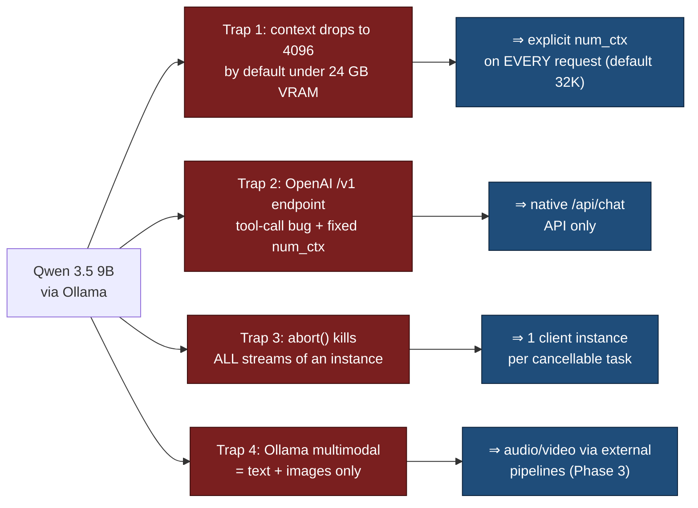
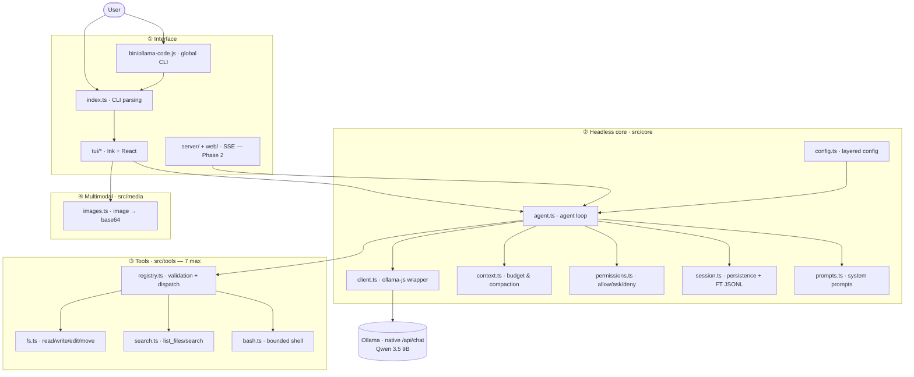
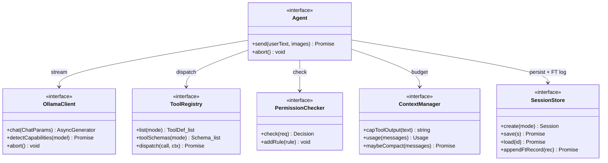
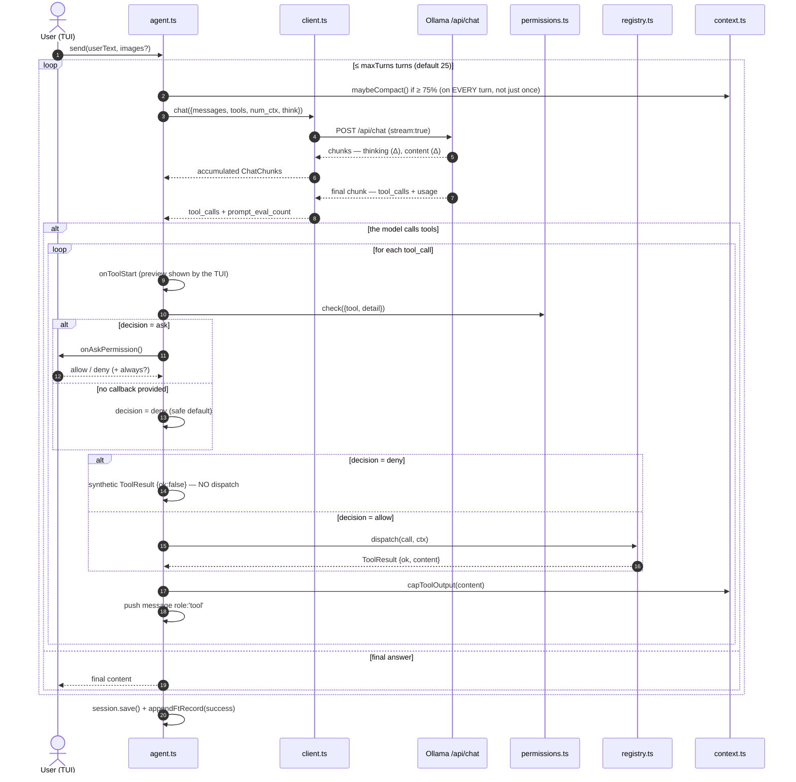
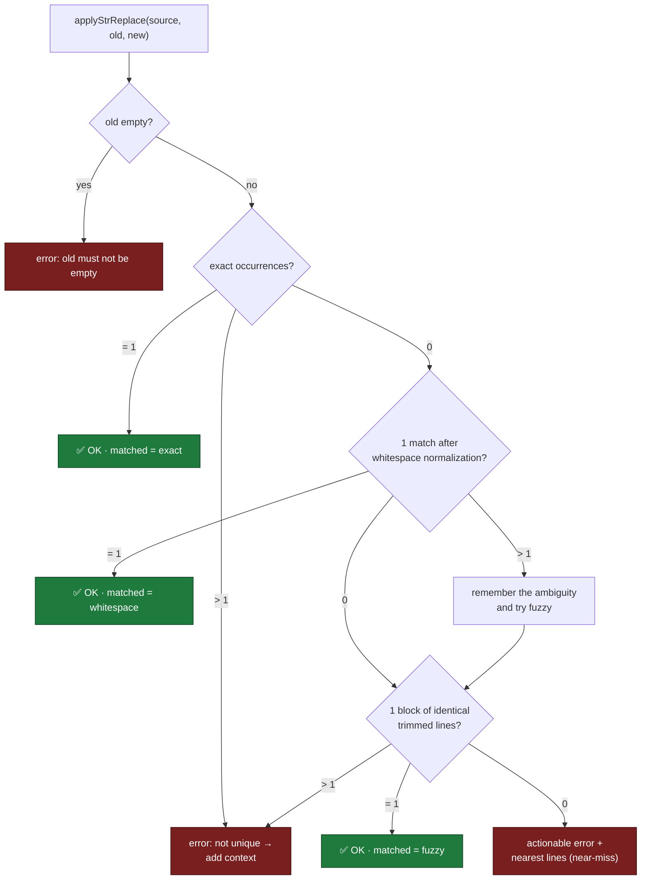
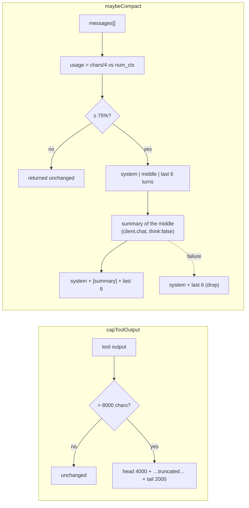
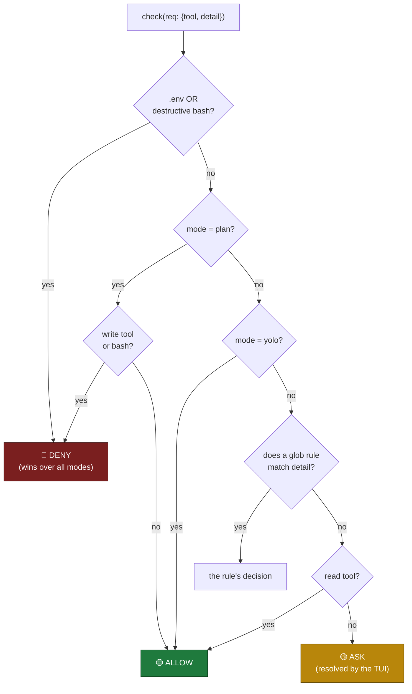
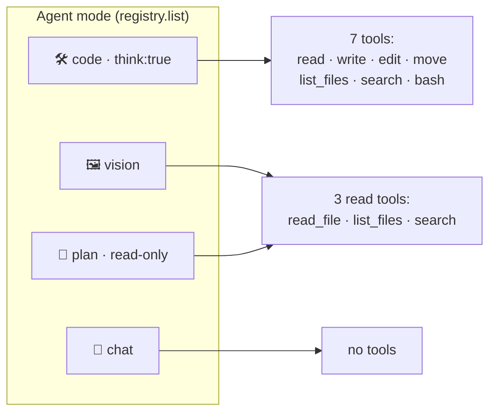
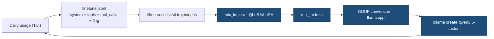
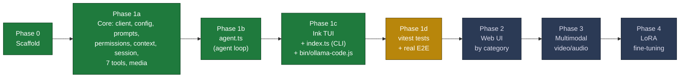

# ollama-code — A local agentic harness for Qwen 3.5 9B

### Design, architecture, and small-model reliability engineering

> **Reference document / internal research paper**
> Version 0.1.0 · Target: Qwen 3.5 9B via Ollama
> This document explains *why* the project exists, *how* it is designed, and *where* it stands.
> For installation and everyday usage, see [README.md](README.md). This document complements (without replacing)
> [docs/CONTRACTS.md](docs/CONTRACTS.md) and [docs/RUNTIME_API.md](docs/RUNTIME_API.md) — the original build
> specifications (`PLAN.md`, `CONCEPT.md`) were removed from the repository once they had served their purpose;
> this document is now their up-to-date synthesis.

---

## Abstract

`ollama-code` is a **100 % local agentic coding harness**: an agent loop that drives **Qwen 3.5 9B** served by **Ollama**, with a tool set for reading, editing, and moving files and running commands inside a codebase — without depending on a cloud LLM billed per token.

The project's central thesis is not "run an LLM locally" (that part is trivial), but **making a 9-billion-parameter model reliable enough for real agentic work**. A model of this size fails where a frontier model succeeds: malformed tool arguments, edits that don't match, drift on long tasks, context saturation. The technical core of the harness is therefore a series of **reliability mitigations**: few tools with short descriptions, string-replacement editing with **progressive matching**, strict argument validation with *actionable* errors so the model can retry, a context budget with compaction, and a permission engine with hard denies.

Longer term, the harness feeds a **self-improvement loop**: every successful session is logged as JSONL in training format, building the corpus for a future LoRA fine-tune (Phase 4) — the model gets better at *your* tasks, at fixed cost.

---

## 1. Introduction & motivation

### 1.1 The problem

Agentic coding assistants (Cowork, Claude Code, Cursor, aider…) are excellent but rely on cloud APIs billed per use. For heavy daily usage the bill grows without a ceiling, and control over the harness's own source code stays out of the user's hands.

The project's goal is **independence**:

1. **No dependency on a cloud LLM** — zero marginal cost per request, data that never leaves the machine.
2. **Control 100 % of the harness's source code** — no black box.
3. **Reproduce the capabilities of a coding agent** — edit codebases, move/create files, run commands, agentically.
4. **Eventually, fine-tune** the model on your own data for better results.

### 1.2 The technical bet

The bet is that a **quantized dense 9B model (Q4_K_M)**, fitting in **16 GB of RAM**, can do *useful* agentic work — provided the model is surrounded by the right scaffolding. This is a non-trivial bet: agent loops are unforgiving with small models, because a single tool error can derail an entire trajectory.

The harness is therefore as much a piece of **reliability engineering** as of LLM integration.

### 1.3 Positioning

| System | Model | Local | Source code owned | Marginal cost |
|---|---|---|---|---|
| Claude Code / Cowork | Cloud frontier | ✗ | ✗ | per token |
| Cursor | Cloud | ✗ | ✗ | per token / subscription |
| aider (+ Ollama) | your choice | ✓ | partial | zero |
| **ollama-code** | **Qwen 3.5 9B** | **✓** | **✓ (fully)** | **zero** |

The harness borrows proven patterns from `aider` (`str_replace` editing, architect/editor fallback) while keeping a minimal, fully owned codebase, designed from day one for fine-tuning.

---

## 2. Technical context: Qwen 3.5 9B + Ollama

The facts below are based on the Ollama and Qwen documentation, verified against a live Ollama server before implementation (see [RUNTIME_API.md](docs/RUNTIME_API.md) §0), and drive most of the architecture decisions.

- **Reference hardware**: a consumer machine with **16 GB of RAM** — *structuring constraint #1*.
- **Runtime**: Node.js ≥ 22, a recent Ollama server on `http://localhost:11434`.
- **Model**: `qwen3.5:latest` — 9.7 B dense, Q4_K_M, ~6.6 GB on disk.
- **Capabilities** (via `/api/show`): `completion`, `vision`, `tools`, `thinking`.
- **Max context**: 262,144 tokens — but **unusable in full** at 16 GB.

### 2.1 The traps that shaped the design



1. **The context falls back to 4096 by default** under 24 GB of VRAM. *An agent dies with 4K of context.* → We force `options.num_ctx` (default **32,768**) on **every** request.
2. **The OpenAI `/v1` endpoint is broken** for this use case: an index bug on multiple streamed tool calls (ollama#15457) and `num_ctx` not settable per request. → **Native `/api/chat` API only.**
3. **`ollama.abort()` kills *all* streams** of an `Ollama` instance. → **One client instance per cancellable task.**
4. **Ollama natively handles only text + images.** No audio/video in the API. → Phase 3: video = `ffmpeg` frames, audio = external STT (`whisper.cpp`) upstream.

### 2.2 Memory budget

At 16 GB, the KV cache is the limiting factor. Qwen 3.5's hybrid **Gated DeltaNet** architecture shrinks that cache (only 8 of the 32 layers do full attention), which makes 32K viable. Fallback options if memory pressure rises: reduce to 24K, or `OLLAMA_KV_CACHE_TYPE=q8_0`.

---

## 3. Design principles

Seven non-negotiable principles govern every decision:

| # | Principle | Rationale |
|---|---|---|
| P1 | **Native `/api/chat` API**, never `/v1` | works around the tool-call bugs and the fixed `num_ctx` |
| P2 | **Explicit `num_ctx` everywhere** | avoids the silent 4K fallback that kills the agent |
| P3 | **7 tools maximum, short descriptions** | a 9B gets lost with too many tools or too much verbiage |
| P4 | **`str_replace` editing with progressive matching** | no diffs/line numbers (fragile), tolerant of imperfections |
| P5 | **Tool errors are *actionable*, never thrown** | the model reads the error and retries instead of crashing the loop |
| P6 | **Headless `core/`, zero UI imports** | same engine for the TUI (Phase 1) and the web UI (Phase 2) |
| P7 | **JSONL training log from day one** | builds the fine-tuning corpus (Phase 4) |

An eighth, cross-cutting one: **never crash the loop**. Permissions, context, session, tool dispatch — all degrade gracefully rather than raising an exception that would interrupt the trajectory.

---

## 4. System architecture

The harness is structured in **four layers**, with one golden rule: `src/core/` is **headless** — no core file imports anything from the UI. The same logic therefore powers the TUI (Phase 1) and later the web UI (Phase 2).



### 4.1 The contracts between modules (the "seams")

All the code is written **against interfaces** defined in `src/core/types.ts`, which allowed the modules to be developed in parallel. `agent.ts` (`createAgent`) builds none of its dependencies: it **receives** them already constructed. The host layer — today the agent-assembly `useMemo` in [src/tui/App.tsx](src/tui/App.tsx) — composes the five other factories (`createClient`, `createRegistry`, `createPermissions`, `createContext`, `createSessionStore`) and passes them to `createAgent`; in Phase 2 the web server will play that composition role, without touching the core.



---

## 5. The agentic core

### 5.1 The agent loop — [src/core/agent.ts](src/core/agent.ts)  ✅ implemented (~258 lines)

This is the orchestrator. On every turn it sends the history to the model, **accumulates** the stream (`thinking` then `content` then `tool_calls`), and if the model requests tools, runs them through the permission filter, executes them **one after another**, feeds the results back as `role:'tool'`, and starts over — until the model answers without a tool, or the **`config.maxTurns`** limit (default 25, re-read live on every iteration) is reached.



Key points of the contract, as implemented:
- **Stream accumulation**: each chunk carries a *delta*. The loop reassembles a single assistant `Message` (thinking + content + tool_calls) before pushing it into the history.
- **Multiple tool calls per turn**: Qwen may emit several `tool_calls` in one turn; each is checked and executed **one after another** (no concurrency), each result returned as `{role:'tool', tool_name, content}` (**no `tool_call_id`** in the native API).
- **`onToolStart` before the permission check**: the event fires before the call to `permissions.check`, so the TUI can display the preview (diff) *while* it asks for authorization.
- **`ask` without a callback = deny**: if `events.onAskPermission` is not provided, an `ask` decision silently degrades to `deny` rather than blocking the loop.
- **"Always allow" (`a`)**: calls `permissions.addRule({pattern: req.detail, decision:'allow'})` with the *exact* string of the command/path — so it only re-matches that precise action, not a class of actions (no prefix or directory generalization).
- **Deny = short-circuit**: a denied call never goes through `registry.dispatch`; a synthetic `ToolResult` is returned directly to the model.
- **Context usage** is displayed continuously via `prompt_eval_count`/`eval_count` from the final chunk (`eval_count` is captured but not consumed further in the current loop).
- **End of turn**: at most one closing message is added — either an internal error, or `[Reached max turns (N). Stopping.]` when turns run out — never both.
- **Persistence**: `session.save()` then `session.appendFtRecord({system, tools, messages, mode, model, success})`, wrapped in a `try/catch` that never lets an exception escape `send()`.

### 5.2 The Ollama client — [src/core/client.ts](src/core/client.ts)  ✅ implemented

A thin wrapper over `ollama-js`. It materializes traps P1–P3: a **single** `Ollama` instance per client, `stream: true`, `options.num_ctx` always sent, and the external `AbortSignal` wired to `abort()`. `detectCapabilities()` queries `/api/show` to dynamically derive `{completion, vision, tools, thinking}` — which makes the harness **model-agnostic** (it also works with `llama3.2` or any future model).

### 5.3 Layered configuration — [src/core/config.ts](src/core/config.ts)  ✅

Merged with increasing precedence, never throwing on a missing file:

```
DEFAULT_CONFIG  ←  ~/.ollama-code/config.json  ←  ./.ollama-code.json  ←  CLI overrides
```

Defaults: model `qwen3.5:latest`, `numCtx` 32768, `maxTurns` 25, Modelfile sampling (`temp 1, top_p 0.95, top_k 20, presence_penalty 1.5`), `think: true`. Nested objects (`sampling`, `permissions`) are deep-merged — with one exception: if a layer provides `permissions.rules`, that array **replaces** the previous layer's entirely rather than extending it.

---

## 6. Small-model reliability engineering

This is where the project's main contribution lies. Three mechanisms make a 9B agentically viable.

### 6.1 Progressive-matching edits — [src/tools/fs.ts](src/tools/fs.ts)  ✅

Rather than demanding a unified diff or line numbers (which small models produce poorly), `edit_file` simply takes `{old, new}` and applies `applyStrReplace`, which **tries three increasingly tolerant strategies** before giving up — and when it gives up, it returns an *actionable* error pointing at the closest line, so the model can retry better.



1. **Exact** — a single literal occurrence → replace. Several → "add context" error.
2. **Whitespace-normalized** — spaces (and newlines) are collapsed; an index map brings the match back to its exact position in the original. Handles divergent indentation/spacing.
3. **Fuzzy line-by-line** — compares *trimmed* lines; sometimes disambiguates where normalization over-collapsed.
4. **Failure** — `buildNotFoundError` finds the most similar line via *longest common substring* and shows it with its context, to guide the retry.

`applyStrReplace` is a **pure, deterministic** function — hence its unit testability: [src/tools/fs.test.ts](src/tools/fs.test.ts) covers 7 cases (empty string, unique exact match, exact duplicate, whitespace-normalized match, indentation-tolerant fuzzy match, actionable error on failure, preservation of surrounding content). `edit_file` expects precisely the argument keys `{path, old, new}`.

### 6.2 Argument validation + actionable errors — [src/tools/registry.ts](src/tools/registry.ts)  ✅

Each tool declares a **Zod** schema, converted to JSON Schema (`z.toJSONSchema`, Zod 4) and sent to Ollama. On dispatch, the arguments emitted by the model are **validated**; on failure, the registry **throws nothing**: it returns a `ToolResult{ok:false}` listing precisely the invalid fields *and* the expected schema. The model corrects itself and calls the tool again. No exception ever bubbles into the loop.

### 6.3 Context budget & compaction — [src/core/context.ts](src/core/context.ts)  ✅

Two protections against window saturation at 16 GB:



- **`capToolOutput`** prevents a chatty command (a verbose `npm test`) from devouring the context: beyond 8000 characters, head + tail are kept.
- **`maybeCompact`**: from 75 % estimated usage (~4 chars/token), the middle messages are summarized by a dedicated model call (`think:false`), preserving the system prompt + the last 6 turns. If the summary fails, it **degrades** by simply dropping the middle — never an exception.

---

## 7. Permission engine — [src/core/permissions.ts](src/core/permissions.ts)  ✅

A **pure** decision function (no disk/network access, no config mutation) that classifies each action as `allow` / `ask` / `deny`. **Hard denies win over all modes**, including `yolo`.



- **Hard denies**: any reference to `.env` (word-boundary regex), and destructive bash (`rm -rf`/`-fr` in all cases and flag orders, `mkfs`, `dd if=`, fork bomb, `shutdown`/`reboot`, `> /dev/sd*`, `chmod -R 777 /`, `mv … /dev/null`). Deliberately **generous**: here a false negative is more dangerous than a false positive.
- **`plan` mode**: read-only — refuses *all* write/bash. This is the planning mode's guardrail.
- **`yolo` mode**: everything allowed except the hard denies.
- **`normal` mode**: glob rules (on `req.detail`) win (first match); otherwise read = `allow`, write = `ask`.
- **Defense in depth**: `fs.ts` re-refuses `.env` and any path outside the `cwd`, independently of permissions — two barriers beat one.
- **⚠️ Known blind spot**: this defense in depth is *not* uniform. `search.ts` has its own path guard (`resolveWithinCwd`) without a `.env` exclusion, and on the permission side, the request for the `search` tool carries the **text query** as its `detail`, not the targeted path/glob — a `search` whose glob targets `.env` but whose query does not literally contain `.env` **bypasses the hard deny** and can return lines from `.env`. `list_files` can likewise enumerate a `.env` file name in `plan`/`vision` mode. Only `read_file`/`write_file`/`edit_file`/`move_file` are reliably protected (details in §13).

`addRule()` lets the TUI materialize an "always allow" as a persistent rule for the session — the added rule matches the **exact string** of the action (no glob generalization), see §5.1.

---

## 8. The 7 tools

Deliberately **exactly seven** (principle P3). Beyond that, a 9B chooses poorly.

| Tool | File | Purpose | Guardrails |
|---|---|---|---|
| `read_file` | fs.ts | read a file | confined to cwd, refuses `.env` |
| `write_file` | fs.ts | create/overwrite | same + `mkdir -p` |
| `edit_file` | fs.ts | progressive `str_replace` | 3-level matching, actionable errors |
| `move_file` | fs.ts | move/rename | both paths validated |
| `list_files` | search.ts | list by glob | skips `node_modules/.git/dist`, cap 500 |
| `search` | search.ts | grep contents | ripgrep if available (30 s timeout), **JS fallback otherwise** (no wall timeout, only the `AbortSignal`); cap 200 results, lines truncated at 300 characters in fallback mode only |
| `bash` | bash.ts | shell command | 120 s default timeout (the model-provided `timeout` argument is not capped), project cwd, stdout+stderr merged and truncated at 20,000 characters (head+tail) |

Three notable engineering details:
- **`search` degrades gracefully**: it detects `rg` on the PATH and otherwise runs an equivalent JS sweep (works even without ripgrep installed) — but only the ripgrep path has a wall timeout (30 s, `SIGKILL`); the JS fallback stops only on `AbortSignal`.
- **`bash` is bounded** on three axes: time (timeout + `SIGKILL`), space (head/tail truncation), and place (`cwd` = project root), and honors the `AbortSignal` — but the time cap is only a *default*: nothing bounds the value the model can request via the `timeout` argument.
- **`search`/`list_files` and `.env`**: see the blind spot documented in §7/§13 — these two tools are not protected against `.env` exposure the same way the four file tools are.

---

## 9. Agent modes — the "UI by category"

The original "interface by category" idea is materialized as **four modes**, which change not only the system prompt but **the subset of tools exposed**. The same selector serves the TUI (Phase 1) and later the web UI (Phase 2).



| Mode | Tools | Purpose |
|---|---|---|
| **code** | all 7 | full agentic coding |
| **vision** | 3 read-only | describe/analyze images + project context |
| **plan** | 3 read-only | investigate and propose a plan, **never write** |
| **chat** | none | plain conversation |

`plan` mode has double protection: the registry only exposes the read tools to it, **and** the permission engine refuses any write. See [src/core/prompts.ts](src/core/prompts.ts) for the prompts (short, per principle P3).

`think` is **not** a per-mode setting of its own: at launch (CLI or config), `config.think` is simply `DEFAULT_CONFIG.think` (`true`) for all four modes, unless explicitly overridden — `--mode` does not touch it. Only when changing modes **during a session** via `/mode` does `defaultThinkFor(mode)` (`src/core/config.ts`) apply — and that function treats `chat`, `vision`, and `plan` strictly identically (`false`); only `code` differs (`true`).

⚠️ **Two independent axes**: the `plan` agent mode (`AgentMode`, controls system prompt + exposed tools, changeable during a session via `/mode`) and the `plan` permission mode (`PermissionConfig.mode`, controls `allow`/`ask`/`deny` decisions) are two distinct settings. The permission mode is set **only at launch**, via `--yolo` / `--plan-perms` on the CLI or a config file — it is frozen for the entire TUI session; `/permissions` only displays the current value and rules, **it does not change it**. Nothing synchronizes the two axes automatically — combining `--mode plan` and `--plan-perms` at launch gives the strongest guarantee during investigation.

---

## 10. Persistence & the fine-tuning flywheel

### 10.1 Sessions + training log — [src/core/session.ts](src/core/session.ts)  ✅

Each session is saved as JSON (`~/.ollama-code/sessions/<id>.json`), and **in parallel** an append-only `finetune.jsonl` collects, from day one (principle P7), one record per session: `{system, tools, messages, mode, model, success}` — system prompt, tool schemas, messages with `tool_calls` as **objects** (not strings), the mode and model used, and a **success/failure flag**.

Two implementation nuances: the `Session.mode` field is frozen at agent-creation time and is **not** resynchronized if the mode changes during the session via `/mode` (unlike the system prompt and the tool schemas, re-read live on every turn, and the FT *record*'s `mode` field, which is also live); and `title` does **not** exist on the `Session` type itself (`{id, createdAt, mode, messages}`) — it only appears on the return type of `SessionStore.list()` and on the TUI's `SessionSummary` interface (`src/tui/commands.ts`), used to display `/sessions`; a session persisted by `session.save()` therefore never has a title.

### 10.2 The flywheel (Phase 4)

This is the long-term bet: the harness *generates its own training corpus* by being used.



The fine-tuned model (`qwen3.5-custom`) is injected back into Ollama and becomes the new engine — better at *your* code and tool-usage patterns. Text/tool-calling comes first (vision via `mmproj` is more complex).

---

## 11. Roadmap & current status



### Actual state of the codebase (as of v0.1.0)

| Component | File | State |
|---|---|---|
| Shared types | `src/core/types.ts` | ✅ implemented |
| Ollama client | `src/core/client.ts` | ✅ implemented |
| Config | `src/core/config.ts` | ✅ implemented |
| Prompts | `src/core/prompts.ts` | ✅ implemented |
| Permissions | `src/core/permissions.ts` | ✅ implemented |
| Context/compaction | `src/core/context.ts` | ✅ implemented |
| Sessions + FT log | `src/core/session.ts` | ✅ implemented |
| fs tools (4) | `src/tools/fs.ts` | ✅ implemented |
| search tools (2) | `src/tools/search.ts` | ✅ implemented |
| bash tool | `src/tools/bash.ts` | ✅ implemented |
| Registry | `src/tools/registry.ts` | ✅ implemented |
| Media images | `src/media/images.ts` | ✅ implemented |
| Agent loop | `src/core/agent.ts` (~258 lines) | ✅ implemented |
| Ink TUI | `src/tui/App.tsx`, `commands.ts`, `components.tsx` | ✅ implemented |
| CLI entry | `src/index.ts` | ✅ implemented |
| Global CLI | `bin/ollama-code.js` (+ `bin` field in `package.json`) | ✅ implemented |
| Smoke test | `scripts/smoke.ts` | ✅ implemented |
| **Unit tests** | `src/tools/fs.test.ts` (7 cases, `applyStrReplace` only) | 🟡 **partial** — `search.ts`, `bash.ts`, `registry.ts`, and the whole TUI/CLI layer have no tests |

> **Where do we stand?** The glue is in place: the agent loop orchestrates the core and the 7 tools, the Ink TUI runs via `npm start` or the global `ollama-code` command (after `npm link`). The remaining critical path is **test coverage** (Phase 1d, currently partial) before Phase 1 can be considered closed, then Phase 2 (web UI) and beyond.

### Available npm scripts

| Script | Command | Purpose |
|---|---|---|
| `npm start` | `tsx src/index.ts` | launch the TUI |
| `npm run dev` | `tsx watch src/index.ts` | dev with reload |
| `npm run typecheck` | `tsc --noEmit` | type checking |
| `npm test` | `vitest run` | unit tests (partial coverage, see above) |
| `npm run test:watch` | `vitest` | tests in watch mode |
| `npm run smoke` | `tsx scripts/smoke.ts` | streaming smoke test, no TUI |

The `bin` field of `package.json` maps the `ollama-code` command to `bin/ollama-code.js`; after `npm link` (or a global install), `ollama-code` works as a command from any directory — see [README.md](README.md).

---

## 12. Verification criteria

Original criteria from the build plan (`PLAN.md`, since removed from the repository — reproduced here for the record) — what proves that each phase really works:

> These checks are now runnable end to end via `npm start` or the global `ollama-code` command (see [README.md](README.md)); none has yet been formally replayed and recorded in this document.

- **Context**: at launch, `ollama ps` must show **32K**, never 4096.
- **E2E loop**: in a sandbox, "create `hello.ts` that prints the date and run it" → `write_file` + `bash` with approvals; then "rename it to `date.ts`, fix the import" → `edit_file`/`move_file`.
- **Edit robustness**: unit tests of the progressive matching + verification that errors are usable (the model retries and succeeds).
- **Vision**: `/image screenshot.png` + "describe this screenshot" → coherent answer.
- **Permissions**: `rm -rf` denied; `plan` mode never writes.
- **FT logs**: the JSONL really contains the system prompt, tool schemas, `tool_calls` as objects, success/failure flag.
- **Memory**: watch pressure at 32K/16 GB; if swapping → 24K or `OLLAMA_KV_CACHE_TYPE=q8_0`.

---

## 13. Risks & limitations

1. **16 GB of RAM = the real constraint.** The whole design (32K default context, aggressive compaction, output caps) flows from it.
2. **9B agentic reliability** — mitigated but not eliminated: few tools, short descriptions, actionable errors, validation + retry. aider's *architect/editor* fallback (a second dedicated call to apply edits) is **not implemented**; as it stands, repeated `edit_file` failures fall back only on the progressive matching's actionable errors.
3. **Partial multimodal**: Ollama = text + images only. Audio/video deferred to Phase 3 via external pipelines (`ffmpeg`, `whisper.cpp`).
4. **`.env` blind spot on `search`/`list_files`**: unlike the four file tools, `search` and `list_files` are not reliably protected against exposing `.env` contents or file names (details in §7/§8). Fix before any use on a repository containing real secrets.
5. **Write preview ≠ real diff**: `buildToolPreview` (TUI, `src/tui/components.tsx`) shows raw content truncated at 600 characters for `write_file`, or a naive `-old`/`+new` block truncated at 200 characters per side for `edit_file` — not a computed line-by-line diff. Enough for a first glance, not enough to review a complex edit in detail before approving it.
6. **Partial test coverage**: only `applyStrReplace` (`src/tools/fs.ts`) has unit tests (7 cases in `fs.test.ts`). `search.ts`, `bash.ts`, `registry.ts`, and the whole `src/tui/*` / `src/index.ts` / `bin/ollama-code.js` layer have no automated tests to date.
7. **Uncapped `bash` timeout on the caller side**: the optional `timeout` argument is only validated as a positive integer — a model call can therefore request an arbitrarily long delay, effectively bypassing the 120 s default guardrail.
8. **Facts not independently re-verified**: the environment assumptions (§2) rely on the Ollama/HuggingFace documentation, checked once against a live server before implementation — re-check them if the environment (Ollama version, model, hardware) changes.

---

## 14. Conclusion

`ollama-code` bets that with the right scaffolding — tolerant edit matching, validation + actionable errors, a context budget, permissions with hard denies, and a deliberately minimal tool set — a **local 9B** model can do *useful* agentic coding work, at **zero marginal cost** with **fully owned source code**. The foundations (client, tools, permissions, context, sessions), the **agent loop**, and the **TUI** (launchable via `npm start` or the global `ollama-code` command) are now all in place. The next critical step is no longer implementation but **proof**: full test coverage (currently partial, §13), real E2E verification (§12), then fixing the `.env` blind spot on `search`/`list_files` (§7/§13). Longer term, the JSONL training log turns daily usage into a **fine-tuning corpus**, closing the loop of independence from cloud LLMs.

---

## 15. From `ollama-code` in the terminal to the first prompt

What actually happens between you pressing Enter after typing `ollama-code` and the TUI showing you a `>` prompt. Every step is grounded in a real file in the repo.

```mermaid
sequenceDiagram
    autonumber
    actor U as User
    participant Sh as Shell (PATH)
    participant N as node
    participant BinJS as bin/ollama-code.js
    participant TSX as tsx (esbuild JIT)
    participant Idx as src/index.ts
    participant Ink as Ink runtime
    participant App as tui/App.tsx
    participant O as Ollama daemon

    U->>Sh: types `ollama-code [flags]`
    Sh->>Sh: PATH lookup → npm bin symlink → bin/ollama-code.js
    Sh->>N: node bin/ollama-code.js [flags]  (shebang)
    N->>BinJS: run wrapper
    BinJS->>TSX: spawnSync tsx --tsconfig <root>/tsconfig.json src/index.ts [flags]
    Note over BinJS,TSX: cwd = user's cwd; stdio = inherit
    TSX->>Idx: JIT-compile & execute
    Idx->>Idx: parseArgs → Partial<Config>
    Idx->>Idx: loadLogo() + renderBannerAnsi → stdout.write()
    Note over Idx: banner is printed BEFORE Ink starts,<br/>so Ink can never re-paint over it
    Idx->>Ink: render(createApp(parsed), { kittyKeyboard: 'auto' })
    Ink->>App: mount
    App->>App: loadConfig + createClient/Registry/Permissions/Context/Session → createAgent
    App->>App: StatusBar mounts, InputLine cursor blinks
    Note over Ink,U: stdin → raw mode; useInput now receives every keypress
    U->>App: types "hi" + Enter
    App->>App: submit() → agent.send("hi")
    App->>O: client.chat({model, messages, tools, num_ctx: 32768, stream:true})
    O-->>App: streaming chunks (thinking Δ, content Δ, tool_calls?)
    App-->>U: live thinking + content rendered
```

Step by step:

1. **Shell PATH resolution.** `ollama-code` sits in a directory listed in `$PATH` — typically `~/.nvm/.../bin/` after `npm link`, or `/usr/local/bin/` after a global install. npm installed a **symlink** there pointing at [bin/ollama-code.js](bin/ollama-code.js) — the file the `bin` field of [package.json](package.json) maps the command to.
2. **Shebang → `node`.** `bin/ollama-code.js` starts with `#!/usr/bin/env node`. The kernel reads that first line and re-executes the file as `node bin/ollama-code.js …`.
3. **The bin wrapper (26 lines).** Its only job is to launch `tsx` on `src/index.ts` no matter where you invoked `ollama-code` from:
   - It looks up `node_modules/.bin/tsx` relative to *this package's root* (so `npm link` works without a global `tsx`), and falls back to a `tsx` on `PATH` if the local one is missing.
   - It passes `--tsconfig <root>/tsconfig.json` explicitly, because tsx by default resolves `tsconfig.json` from the caller's `cwd` and would miss this project's `"jsx": "react-jsx"` setting.
   - `cwd: process.cwd()` is **preserved** — the tools (`read_file`, `bash`, `list_files`…) operate on the directory you launched `ollama-code` from, not on the package's own directory.
   - `stdio: 'inherit'` — terminal I/O is shared with the child, which is how Ink can put your keyboard in raw mode.
4. **`tsx` runs `src/index.ts`.** No build step exists in this repo; `tsx` compiles TypeScript to JavaScript in memory via esbuild.
5. **`main()` in [src/index.ts](src/index.ts).**
   - `parseArgs(process.argv.slice(2))` walks the flags (`--model`, `--mode`, `--num-ctx`, `--host`, `--permission` / `--yolo` / `--plan-perms`, `--help`/`-h`) into a `Partial<Config>`. Unknown flags exit with code 1 and print the help.
   - `loadLogo()` reads [assets/logo.svg](assets/logo.svg) (or the `.png` fallback), decodes it to a pixel grid, and `renderBannerAnsi(art, VERSION, columns)` writes the banner **straight to `process.stdout` before Ink is initialized**. This is deliberate: the banner used to live inside Ink's `<Static>`, which re-paints on every render — the timing of that write could smear the first pixel row over the shell prompt. Printing before Ink solves it permanently (commit `ab87adb`).
   - `render(createApp(parsed), { kittyKeyboard: { mode: 'auto' } })` hands control to Ink. `kittyKeyboard: 'auto'` opts into the [kitty keyboard protocol](https://sw.kovidgoyal.net/kitty/keyboard-protocol/) when the terminal supports it (kitty, Ghostty, WezTerm), which is what makes real `Cmd+J/R/L` reach the app as `key.super`. On every other terminal, `Option+…` (`key.meta`) is the fallback.
6. **`createApp(parsed)`** — one function in `src/index.ts`'s import graph. `loadConfig(parsed)` merges four layers in increasing precedence: `DEFAULT_CONFIG` ← `~/.ollama-code/config.json` ← `./.ollama-code.json` ← CLI overrides. Missing files are ignored (never throws). Then it returns `<App config={config} />`.
7. **`App` mounts** — the single React functional component in [src/tui/App.tsx](src/tui/App.tsx):
   - The `useMemo` at the top composes the entire headless core in one shot: `createClient({host})` (Ollama HTTP wrapper), `createRegistry()` (7 tools), `createPermissions(config.permissions)`, `createContext(config, client)`, `createSessionStore(~/.ollama-code/sessions)`, then `createAgent({...})` receives all five and returns the `Agent`. This is the "host composition role" described in §4.1.
   - Ink switches stdin to raw mode; keys now flow through `useInput`.
   - The initial render paints the `StatusBar` (`mode · model · ctx 0/32,768`), an empty log, the pixel-art footer, and the `InputLine` with a blinking cursor.
8. **First message you send.** You type `hello`, press Enter, `submit()` runs. Since it doesn't start with `/`, it goes to `agent.send('hello')`, which:
   - appends a `role:'user'` message,
   - calls `client.chat({model, messages, tools, num_ctx, stream:true})` — POST `/api/chat` on `config.host`,
   - streams `thinking` deltas then `content` deltas back through `events.onThinking` / `events.onContent`, which update the live blocks in App state, then agent loop §5.1 takes over.

That's the full path from keystroke to first token.

---

## 16. Slash commands

Every line starting with `/` is intercepted by the TUI (never sent to the model). The dispatch lives in [src/tui/commands.ts](src/tui/commands.ts) — a framework-free `switch`, testable without Ink — and every side effect flows through a `CommandActions` bridge implemented by `App.tsx` (`configRef` mutation, overlay state, notices).

| Command | Argument | Effect |
|---|---|---|
| `/help` | — | Prints the command list with descriptions. |
| `/mode` | — | Prints the current agent mode. |
| `/mode <code\|chat\|vision\|plan>` | required | Switches the mode: writes `configRef.current.mode` (which the agent re-reads live on every turn) and resets `configRef.current.think` via `defaultThinkFor(mode)` (`true` for `code`, `false` for the others). Unknown value → notice listing the valid modes. See §9 — this does **not** change the permission mode. |
| `/model` | — | Opens the **model picker overlay**. Fetches `GET /api/tags` via `OllamaClient.listModels()`, lists every installed model with parameter size · quantization · disk size, marks the active one `● current`, and starts the selection on it. Empty list → notice suggesting `ollama pull`. Daemon unreachable → notice with the error and the current model, no crash. Navigation `↑`/`↓`/`j`/`k` (wrap-around), `Enter` selects, `Esc`/`Ctrl+C` cancels. |
| `/model <name>` | required | Direct setter: writes `configRef.current.model = name`. Effective on the next `client.chat()` call — the agent reads `config.model` live. |
| `/image <path>` | required | Loads the image at `path` via `imageToBase64` and queues its base64 payload; queued images are sent alongside the next message, then cleared. Path is relative to cwd. Errors (missing file, unsupported format) become a notice, not a crash. |
| `/clear` | — | Clears the displayed log (`setLog([])`) and any queued images. **Does not** reset the model's conversation history — the agent still remembers everything; only the TUI display is emptied. |
| `/sessions` | — | Lists up to 20 saved sessions from `~/.ollama-code/sessions/`, showing `id`, `createdAt` and the optional `title`. Read-only; there is no "load" command yet. |
| `/permissions` | — | Prints the current permission mode (`plan`/`normal`/`yolo`) and any active rules. **Display only** — the permission mode is set at launch (`--permission` / `--yolo` / `--plan-perms`) and frozen for the whole session. |
| `/<anything else>` | — | Prints `Unknown command: /… Type /help for the list of commands.` Never leaks a typo to the model as a literal user message. |

Notes on the mechanics:

- **Live-config trick.** Mutations from `/mode` and `/model` write directly to `configRef.current` (a `useRef` in `App.tsx`) rather than triggering a state update. The agent reads `config.model` and `config.mode` on **every** call, so the change takes effect on the very next turn without any wiring between the command and the agent. The visible `StatusBar` refresh is driven by the accompanying `notice()` call (which does trigger a re-render).
- **Overlays.** `/model` (picker) and the tool-permission prompt are the two interactive overlays. The `useInput` handler routes keys through a priority chain: permission prompt first, then the model picker, then global shortcuts (`Ctrl+C`, `Cmd+J/L/R`, `Ctrl+D`), then the input line. Each overlay **swallows** every key while active so nothing leaks into the input.
- **Availability.** Slash commands are dispatched by `submit()`, which is gated by `if (busy) return`. Commands are available at any *idle* moment — including mid-session between two turns — but not while the agent is generating. To switch models mid-stream, abort with `Ctrl+C` first, then `/model`.

---

### Appendix A — Glossary

- **num_ctx**: context window size, in tokens, forced on every Ollama request.
- **str_replace / progressive matching**: string-replacement editing, with 3 tolerance levels (exact → whitespace → fuzzy).
- **thinking**: the model's reasoning trace, streamed *before* the content (Qwen supports `think: true|false|low|medium|high`).
- **compaction**: automatic summarization of older messages when the context reaches 75 %.
- **actionable error**: a failure message designed so the model understands *how* to correct itself and retries, rather than an exception that breaks the loop.
- **fine-tuning flywheel**: the usage → JSONL → LoRA → GGUF → new Ollama model cycle.

### Appendix B — Reference files

- [README.md](README.md) — installation, quick start, everyday usage.
- [HELP.md](HELP.md) — every command and keyboard shortcut.
- [docs/CONTRACTS.md](docs/CONTRACTS.md) — TypeScript interfaces between modules.
- [docs/RUNTIME_API.md](docs/RUNTIME_API.md) — verified library surface + per-file export contracts.

> `CONCEPT.md` (initial vision and goals) and `PLAN.md` (build plan) were removed from the repository once they
> had served their purpose; this document (`DOCUMENTATION.md`) is their up-to-date synthesis and is authoritative.
> Note that `docs/CONTRACTS.md` and `docs/RUNTIME_API.md` remain frozen specifications, written *before* the
> implementation: a few minor details drifted in practice (for example `ToolRegistry` is defined in
> `src/tools/registry.ts` rather than `types.ts`, and `PermissionChecker` gained an optional `addRule`) — this
> document reflects the actual code.
